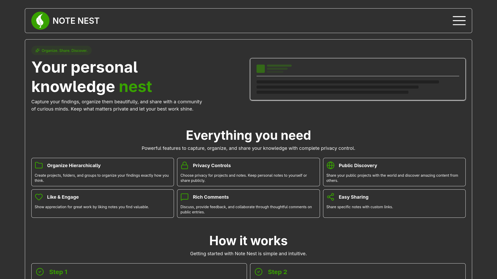
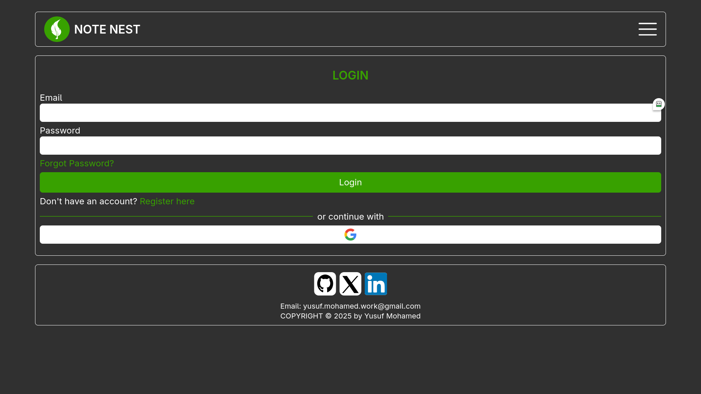

# 🪶 NOTE NEST

A personal and social note-keeping platform where users store their thoughts, findings, and experiences — privately or for others to explore.



## 🌟 Features

- **Organized content**: Create projects, folders, or groups to structure your notes.
- **Privacy control**: Projects and entries can be public or private.
- **Rules for entries**:
    - Child entries cannot be public if the parent project is private.
    - Entries can be private even if the parent project is public.
- **Social interactions**: View, like, share, and comment on public projects and entries.

## Tech Stack

- **Backend**: Golang
- **Frontend**: React.js
- **Database**: PostgreSQL

## 🛠️ Setup

1. Clone the repo:

```
git clone https://github.com/Yusufdot101/Note-Nest.git
cd Note-Nest
```

2. Run docker-compose:

```
docker-compose up
```

Fronted: [localhost:5173](http://localhost:5173)<br>
Backend: [localhost:8080](http://localhost:8080)

## 📂 Project Structure

Note-Nest/ <br>
├─ backend/ # Golang API <br>
├─ frontend/ # React.js app <br>
├─ docker-compose.yml <br>
└─ README.md <br>
